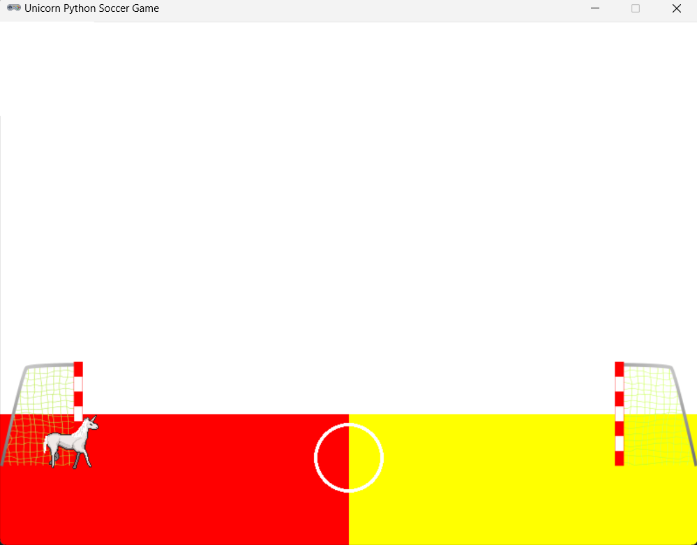
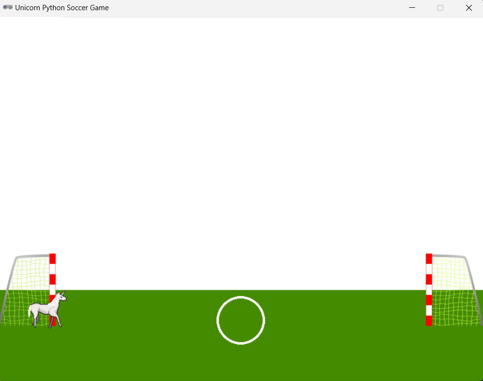

# Thesis Proposal: Designing a Sports Game for Learning Basic Python Concepts

## Introduction

As a student majoring in computer science, Esteban Mendez has always been passionate about finding innovative ways to engage learners and helping them improve their skills. In this thesis proposal, Esteban Mendez will be designing a sports game that will not only be enjoyable for users but also help them learn basic Python programming concepts.

Computer science education has become increasingly important in today's world. With the growing demand for technology and innovation, there is a need for skilled individuals who can design and develop software applications. However, learning computer science can be challenging for many individuals, especially those who do not have prior experience or interest to the subject. Therefore, it is important to find new and innovative ways to engage learners and help them develop their skills in programming.

## Motivation

The motivation behind this project is to provide a fun and engaging way for people to learn programming. Many students find programming difficult and often lose interest due to the complexity of the subject. By creating a game that is enjoyable and interesting, students will be more motivated to continue learning and practicing their programming skills.

This project aims to address the challenges of learning computer science and provide a fun and engaging way for people to learn programming. Many students find programming difficult and often lose interest due to the complexity of the subject. By creating a game that is enjoyable and interesting, students will be more motivated to continue learning and practicing their programming skills.

In addition, the author identifies himself with the project, as he needed sometimes to practice some of the basics of Python programming language as he had interviews with companies with technical questions that needed to be answered without looking over notes or the internet. One of the main things here is to make the user practice and learn in a fun way so it can be remembered easily.

Furthermore, this project aims to promote the importance of computer science education among individuals who may not have had prior exposure to the field. The game will be designed to appeal to a wide range of individuals, including those who are not currently pursuing a career in computer science.

### Current State of the Art

Currently, there are several game-based learning (GBL) platforms and tools available that teach programming concepts. Examples include CodeCombat, CodeHS, and Scratch. These tools offer various types of games and challenges to help users learn programming in a fun and interactive way. Some of them are pretty simple to understand and that is why Esteban Mendez chose to develop it using Pygame, a Python library to create interactive games.

The proposed project idea aims to design a sports game for learning basic Python concepts. The research area involves game-based learning and making students learn, as well as Python programming language. In addition, this is a challenge for the author too, as he does not know much about how to use and code with Pygame and he has been learning this for the past few weeks. The project's specific proposed idea is to create a sports game that is both fun and educational, teaching users the basics of Python programming.

As of right now, there are a few sports games available that teach programming concepts. However, most of these games are limited in terms of their educational value and user engagement. To address these shortcomings, I have done extensive research on the topic and have been learning how to use Python programming language and Pygame to create a prototype of a soccer game.

The GAP of the project is the fact of knowing to test if the students learned or not and which software is going to be used to create the game. There are internal things inside those main topics that might influence later on throughout the project investigation, test, and error, but research has been done by reading about the testing of the software and whether people learned or not.

To address these shortcomings, this project aims to design a sports game that teaches basic Python programming concepts. The game will be designed to appeal to a wide range of individuals, including those who are interested in sports and may not have prior experience in programming.

### Goals of the Project

The primary goal of this project is to create a sports game that is both fun and educational. The game will serve as a tool to help learners improve their programming skills in an interactive and engaging way. Additionally, the game will help promote the importance of computer science education among individuals who may not have had prior exposure to the field.

The secondary goal of this project is to evaluate the effectiveness of the game in teaching programming concepts. By conducting an experimental study, the project aims to determine which design elements are most effective in creating a positive learning environment.

## Related Work

In designing this game, the project will leverage previous research on game-based learning (GBL) and the use of gamification in education. Specifically, the project will examine how these concepts can be applied to designing a sports game that teaches basic programming concepts.

Gamification is the process of using game mechanics, such as points, badges, and leaderboards, to engage users and motivate them to achieve their goals. In education, gamification has been used to improve student engagement and motivation.

GBL is a type of gamification that uses games to teach educational concepts. Games are designed to be fun and engaging, and they can be used to teach a wide range of subjects, including computer science.

By examining how gamification and GBL have been used in education, this project aims to create a sports game that is both enjoyable and educational.

## Prototype

The prototype is created with Pygame. The prototype that Esteban Mendez created has a start of a game and an end, which will test if Esteban Mendez knows how to use the software and it will also include the use of a picture as a background. The prototype more in detail will be a soccer game that has two sides, and two goals. Not all of the players are going to be displayed, it will be a 1 vs 1 player game. In the prototype, there is just the player that the user is going to be using.

The prototype will support the project as it has some of the basics of the game. Some of the mechanics still need to be fixed as it is only a prototype, but it will support the project by just continuing what it is started already.The prototype will be useful for the planning, execution, and completion of the project as it is a step closer to the actual project and gives an idea of how it will look like and what needs to be done in a more effective way.

The movement of the game was by using the arrow keys in the keyboard and the space bar to jump.

## Feasibility

The project that Esteban Mendez will be conducting is feasible because he is a hard worker and the software that he will be using to create the project will be learned over the summer. This will give him an advantage in creating the game and how to develop the mechanics of the game correctly. On the other hand, there are some factors that are not being taken into consideration like time management. In this case, Esteban Mendez as will be learning Pygame during the summer, it will give him more time to concentrate in the details of the game as he will master the mechanics.

As a result, the project will be feasible for Esteban Mendez to develop it during the next academic year, 2024.

## Experiments

### Experimental Design

The experimental study for this project will aim to determine how to capture the interest and attention of learners interested in computer science. Specifically, the study will focus on color choice and how it affects user engagement. Users will be presented with different color options, and their choices will be tracked to determine which colors are most effective in capturing their attention.

The experiment was really important as it was testing what colors the customers like to play the game more, making sure that they liked the colors, it can be more intriguing to play. With this said, the steps taken to respond to the hypothesis of the experiment was to test the colors in the prototype, as the prototype is really important in this type of experiment.

Having different people, such as gender and qualities was also a factor in the experiment. The experiment was expected to get different results, as it was important to test different people throughout campus or class. This is one of the most important factors as people can have similar interests if they share a lot of activities.

### Evaluation

The experimental results will be used to answer the research question: how can a sports game be designed to effectively teach basic programming concepts while engaging users? By analyzing user choices and engagement levels, the study will determine which design elements are most effective in creating a positive learning environment. The evaluation took place in Alden, Computer Science building, and the data was gathered into a notebook. After gathering all the data, it was analyzed to get the results in which will tell what colors are better for the game that is being developed. Also, the evaluation is open to suggestions about the project.

## Conclusion

### Summary of Results

Based on the experimental results, the game design will be refined to incorporate the most effective design elements. The results of the study will be used to create a more effective sports game that is both engaging and educational.

The results of the experiment were analyzed by making some questions for the ones that are looking at the game to answer. Then there was a graph in which the results were shown that the colors more for green than the other bright colors were chosen. After analyzing all of the results there were many suggestions too, which were to include the colors of that I have been tested in another part of the game as it is important to show that teams have a color.

As you can see in the image below, the winner of the colors that were tested was this one.

### Future Work

In the future, there is a plan to further research GBL and investigate how coding puzzles can be incorporated into the game to further investigate its educational value. Additionally, explore the ethical implications of the project and consider how the game can be ethically delivered to users.

On the other hand, there needs to be more present knowledge about Pygame and how it mostly works. Over the summer, the author will learn more about Pygame and its mechanics to get a better understanding of what to do in difficult situations when code is not compiling. Furthermore, there will be more investigation about the colors and tools to make the game more interesting for people to play with it.

As for now, the first step that will be taken into consideration is the understanding on how Python programming language can be included in the game to be learned. Secondly, Pygame will take on and will be learned further to understand the mechanics of how Pygame works and how everything that needs to be integrated can be integrated.

### Conclusions

Overall, Esteban Mendez believes this sports game will be a valuable tool for promoting computer science education and helping learners improve their programming skills. With its engaging design and educational value, the game has the potential to make a significant impact in the field of computer science education.

Esteban Mendez believes that the project is going to be fun to develop as it is including him as a target to use the game and practice his skills in Python programming language. With that said, it is important to take into consideration that the students are going to be at the same place that the creator of the game, Esteban Mendez, is at right now as they are looking for jobs in the future.

### Research questions

Does playing a game-based learning coding concepts game improve students' understanding and retention of coding concepts compared to traditional teaching methods?

### References

	- https://www.jstor.org/stable/jeductechsoci.18.3.75
	- https://ieeexplore.ieee.org/document/6268112
	- https://www.pygame.org/news
	- https://pythonprogramming.net/pygame-python-3-part-1-intro/
	- https://newprairiepress.org/cgi/viewcontent.cgi?article=4001&context=aerc#:~:text=Colors%20help%20learners%20increase%20their,Dzulkifli%20%26%20Mustafar%2C%202013).

---
