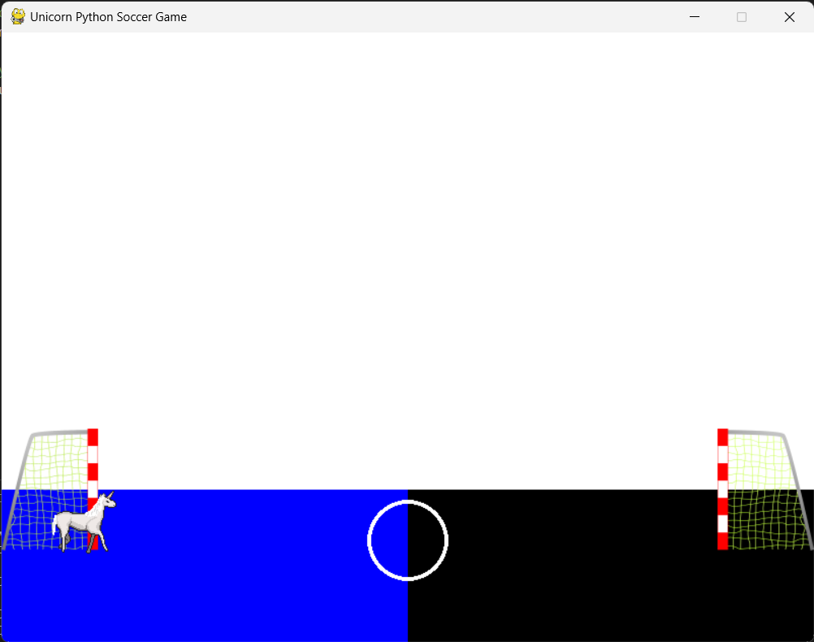

## My Experiment
The experiment will produce data in which will tell me which colors are the most attractive for students or users that are going to be using my game or prototype to learn, learning contains a lot of concentration on the way, so which colors are not distracting and are way more appealing to learn more. The data that the experiment will produce will be the best colors to use for concentrating during learning, some can be more distracting than others or other can be helpful to pay attention.

## Prototype
The prototype is being done with the use of Python, VS code and Pygame library from Python. What the prototype will do is that the game will be created, but it will be just a simple game, in which it will just do one thing. I think that using the Pygame library is going to be helpful as that is the software that I will be using for the game itself. In the prototype I will be using an extension of that Pygame library which is more simple for prototypes, which is called Pygame Zero. The prototype will be able to have a player and move throughout the screen, which will make it more interactive with the user. Also, it will be a soccer game that will include two goals on each side.

## Prototype test color 1

## Prototype test color 2

## Prototype test color 3

## Results
When the experiment got executed, I got some interesting results, some of the people liked the colored fields and most of the other students liked the normal green with white grass field. That is really interesting as the results tell me that they have watched soccer and they might be interested in playing the game. Also, I will take in consideration those that told me that the field needs to be colored, which I thought that I could include the flag color on top of a post from the goal on on top of the screen. With this I will be adding more color and doing what the users want, after all, they are the ones that are going to play the game. I learned that there are many different opinions on bright colors or high intensity colors in the same place.